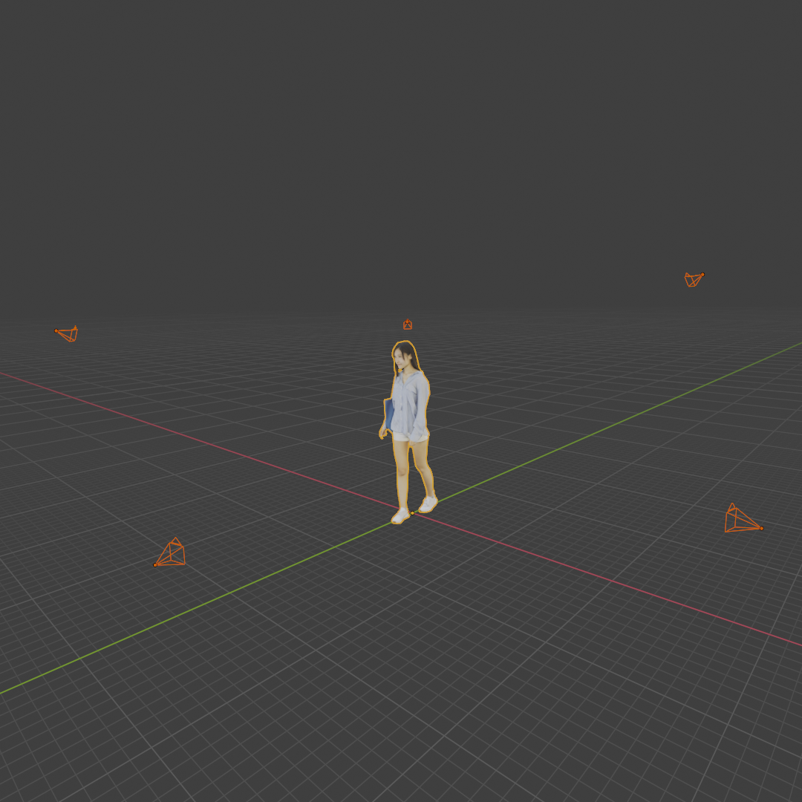

# Blender Camera Calibration

This is a sample code for obtaining camera parameters of blender's camera object. 
## Script

[camera_calibration.py](./camera_calibration.py) is the script to obtain camera parameters of blender camera. This script is meant to be used in a blender project.

## Blender Project

`blender/` contains a sample blender project. Sample blender project is included in this repository, and in this project, 5 cameras are set up to surround a free 3D human model.

## Data

### 3D Human Model

Free 3D human model is [Woman Jess Casual Walking 001 free 3D model](https://www.cgtrader.com/free-3d-models/character/woman/woman-jess-casual-walking-001) from cgtrader.

### Environmental Texture

Environmental Texture is [Green Point Park](https://hdrihaven.com/hdri/?h=green_point_park) from [HDRI Haven](https://hdrihaven.com/).